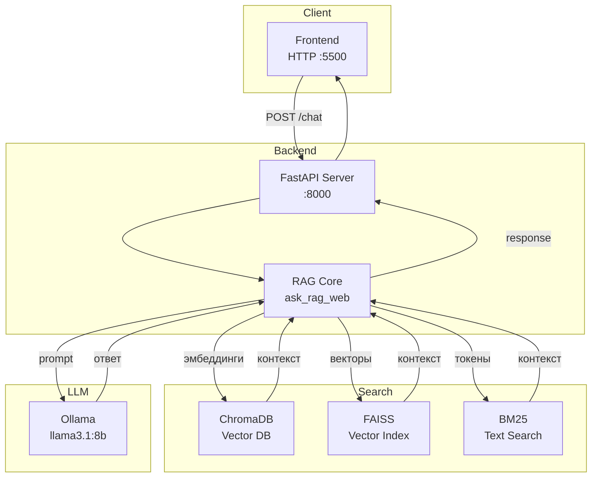

# RAG Финансовый Аналитик

Система для анализа финансовых новостей и ответов на вопросы с использованием Retrieval-Augmented Generation (RAG).

## Стек технологий

| Компонент | Технология | Назначение |
|-----------|-----------|------------|
| **Язык** | Python 3.10+ | Основной язык разработки |
| **Векторные БД** | ChromaDB | Хранение и поиск эмбеддингов |
| **Поиск** | FAISS (CPU) | Индексация и быстрый поиск векторов |
| **Ранжирование** | BM25 + Cross-Encoder | Гибридный поиск (BM25 + векторный + реранкинг) |
| **LLM** | Llama 3.1 8B (через Ollama) | Генерация ответов |
| **Эмбеддинги** | nomic-embed-text | Преобразование текста в векторы |
| **Веб-фреймворк** | FastAPI | Backend API |
| **Фронтенд** | HTML/CSS/JS (статический) | Чат-интерфейс |
| **Обработка данных** | Pandas, NumPy | Анализ и обработка данных |
| **Дополнительно** | Sentence Transformers | Re-ranking результатов |


## Структура проекта

```bash
├── rag.py                 # Индексация данных
├── rag_ask.py             # Основная логика ответов
├── server.py              # FastAPI сервер
├── bm25_index.py          # BM25 индексация
├── faiss_index.py         # FAISS индексация
├── chunking.py            # Разбиение текста на чанки
├── memory_store.py        # Хранение истории
├── multi_query.py         # Генерация альтернативных запросов
├── trend_analysis.py      # Анализ трендов
├── requirements.txt       # Python зависимости
├── news_dataset.csv       # Исходные данные (нужен)
├── chroma_db/             # ChromaDB хранилище (создаётся)
├── bm25.pkl               # BM25 индекс (создаётся)
├── faiss.index            # FAISS индекс (создаётся)
├── faiss_docs.pkl         # Метаданные (создаются)
└── memory.json            # История запросов (создаётся)
```
## Установка

### 1. Клонирование репозитория

```bash
git clone <your-repo-url>
cd <project-folder>
```

### 2. Установка Python зависимостей

```python
pip install -r requirements.txt
```
### 3. Установка Ollama

```markdown
Ollama устанавливается отдельно (не через pip):
```

* Windows/macOS/Linux: Скачайте с ollama.ai

* После установки запустите Ollama (фоновый сервис)

### 4. Загрузка моделей

```bash
ollama pull llama3.1:8b
ollama pull nomic-embed-text
```

### 5. Подготовка данных

Поместите файл news_dataset.csv в корневую папку проекта.

## 🚀 Запуск

### Шаг 1: Инициализация базы данных

Запустите скрипт для обработки данных и создания индексов:


```python
python rag.py
```

Что произойдёт:

* Загрузка данных из news_dataset.csv

* Разбиение текста на чанки (150-200 слов)

* Генерация эмбеддингов через nomic-embed-text

* Создание индексов BM25 и FAISS

* Сохранение метаданных

* Запись в ChromaDB

### Шаг 2: Запуск backend сервера

```bash
uvicorn server:app --reload
```

Сервер будет доступен по адресу: http://localhost:8000

* API эндпоинт: POST /chat

* Swagger документация: http://localhost:8000/docs

### Шаг 3: Запуск frontend (чат интерфейс)

В отдельном терминале:

```bash
python -m http.server 5500
```

* Откройте браузер: http://localhost:5500

### Альтернативный запуск (через API):

```bash
curl -X POST http://localhost:8000/chat \
  -H "Content-Type: application/json" \
  -d '{"message": "Какой сейчас курс доллара?"}'
```

## 🏗️ Архитектура системы


